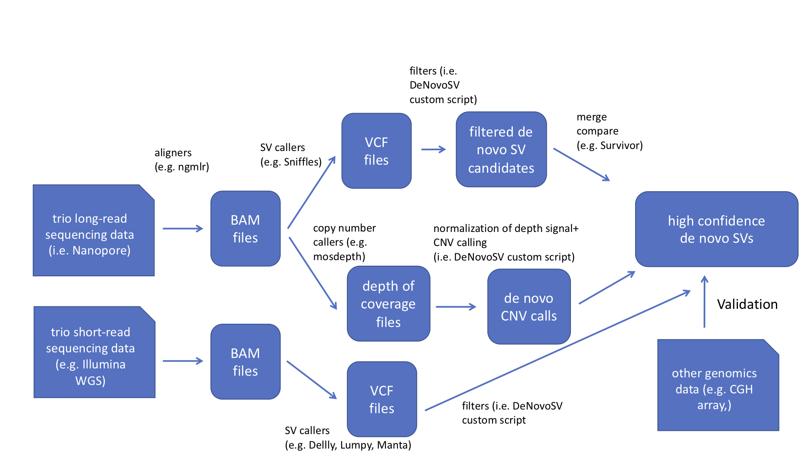

# DeNovoSV

## Workflow

DeNovoSV is a pipeline designed to help identify and validate de novo structural variants (SVs) in genomics datasets from trios (i.e. samples from biological father, mother, and child = proband). Based on SVs called from Oxford Nanopore long-read sequences and Illumina whole genome sequencing (WGS) short-reads, high confidence de novo SVs are called by comparison with other datasets such as comparative genome hybridization arrays. This pipeline includes custom scripts to filter the variant call file (VCFs) generated from SV callers such as Sniffles, and includes identification of de novo copy number variants (CNVs) found using mosdepth. 

## Abstract

The goal of DeNovoSV is to identify and validate de novo structural variants found in a trio (i.e. a biological father, mother and de novo in a proband = child). In a test case, we used DeNovoSV to find high confidence, de novo SVs arising during the postzygotic development of a child presenting with a developmental disorder. Available data from the trio included CGH array data,  Nanopore long read sequences and Illumina whole genome sequencing (WGS) reads. At the start of this hackathon, we lacked an integrated bioinformatics pipeline to identify and prioritize de novo structural variants, so that such genomics datasets could be combined, compared and validated. The DeNovoSV pipeline was implemented as described here.

## Inputs

* Oxford Nanopore long-read sequencing BAM files from a trio
* Illumina WGS sequencing data from the trio
* (Array comparative genome hybridization data from the trio)
* (long-read input) VCF files from Sniffles
* depth of coverage from mosdepth
* (short-read input) VCF files from Delly, Lumpy, Manta

## Custom filters implemented in DeNovoSV

* > or = 5 Nanopore reads
* no KI
* no mapping to chr. GL (unmapped contig)
* no genotype 0/0 (all reference genotype)

## Outputs

* high confidence de novo SVs called by DeNovoSV

## Authors

* Colin Diesh - pipeline
* Claudia M.B. Carvalho - genetic trio
* 
* Elbay E. Aliyev
* Haowei Du 
* Michael M. Khayat
* ChunHsuan Lo
* David E. Symer

