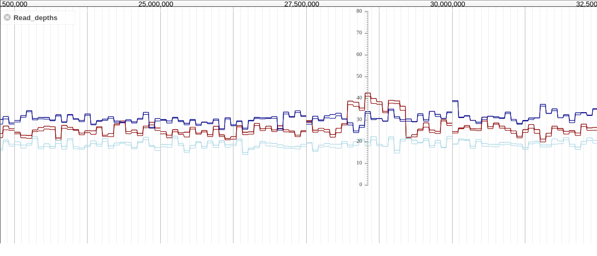
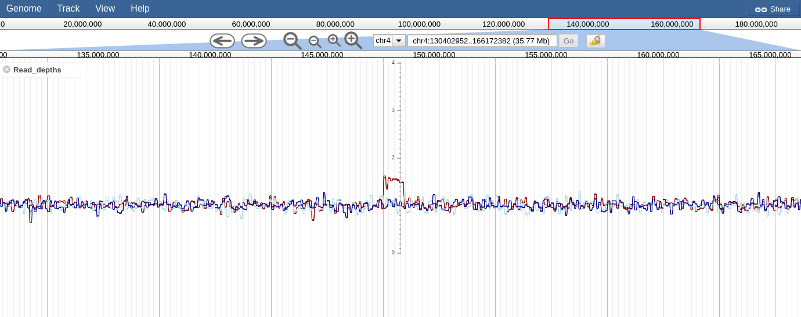
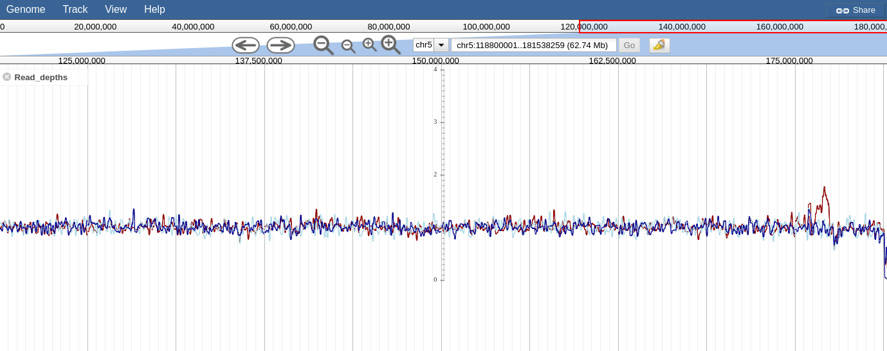
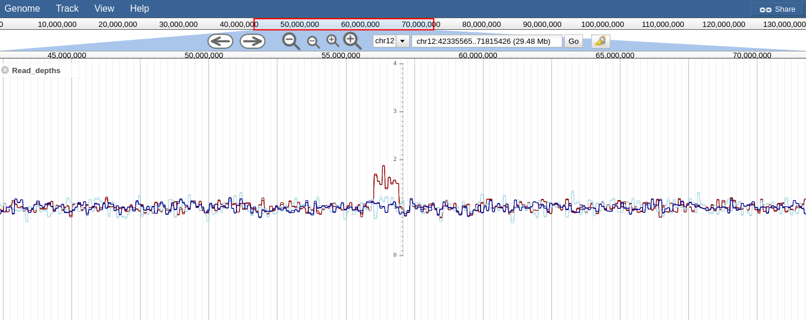

## Day 1: getting started

Yesterday, we had a hard time getting launched

* our nanopore data took was slow to upload to DNAnexus
* we were having a hard time finding our Sniffles VCF calls being related to our known Array CGH CNVs in pacbio BAM

## Day 2: We decide to try to look at Illumina reads instead of nanopore

But wait...we try and look a some of the data in IGV and we find all the reads are missing. There is one read in a sea of nothingness!

Therefore, today we started looking at Illumina...we abandoned this too due to problems....but a lesson for everyone


## Day 2 lesson: QC your data!!!!


Here is a screenshot of our Illumina BAM file


These singular unpaired reads get called as structural variants!


In fact, looking at a mosdepth summary, we see the data is essentially truncated!

```
chrom               length              bases               mean                min                 max
1                   249250621           10709697590         42.97               0                   1043781
2                   243199373           4096207054          16.84               0                   93202
3                   198022430           9756089             0.05                0                   46211
4                   191154276           3296818             0.02                0                   1483
5                   180915260           3965974             0.02                0                   108
6                   171115067           2604102             0.02                0                   311
7                   159138663           4535353             0.03                0                   605
8                   146364022           1946682             0.01                0                   281
9                   141213431           2429873             0.02                0                   677
10                  135534747           579083765           4.27                0                   417535
11                  135006516           2250042             0.02                0                   357
12                  133851895           2941753             0.02                0                   1155
13                  115169878           589074              0.01                0                   47
14                  107349540           789239              0.01                0                   506
15                  102531392           1882241             0.02                0                   128
16                  90354753            21738626            0.24                0                   784
17                  81195210            670010              0.01                0                   115
18                  78077248            623937              0.01                0                   96
19                  59128983            62299697            1.05                0                   228017
20                  63025520            846763              0.01                0                   442
21                  48129895            730696              0.02                0                   178
22                  51304566            3429658             0.07                0                   577
```


## Day 2 success: CNV confirmation from long read coverage

## Array CGH loci

These are the loci that we know from Array CGH that we want to validate


## Visualizing long read coverage

We ran mozdepth on our nanopore BAM files, which had been aligned with minimap2 and ngmlr

This is useful to test whether CNV can be detected by long reads

Long reads can align fully across smaller SV sizes, but they cannot really fully distinguish a CNV very well so coverage metrics are still valuable

Therefore, I worked with the mozdepth output which is in BEDGraph using CSI tabix indexes, and made adapter for JBrowse quickly

I use the jbrowse multibigwig plugin and load the files and produce this figure




This looks promising, but it is raw read counts so it is hard to see the proper signal

We then do a median scaling on the score column by dividing by the median score on each chromosome


Chr21:28MB

## Here are the rest



Chr4:148MB

Chr5:175MB

Chr6:11MB

Chr10:120MB

Chr12:56MB

Chr13:111MB

Chr14:41MB
